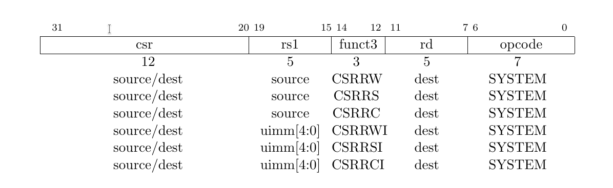
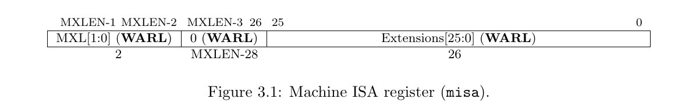
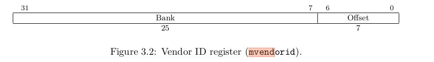
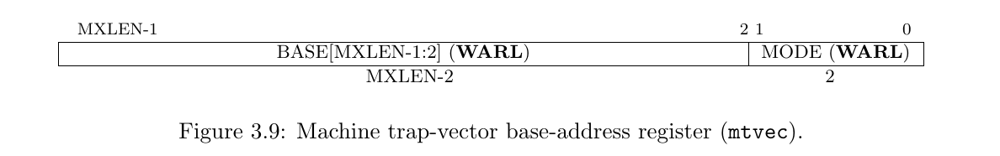
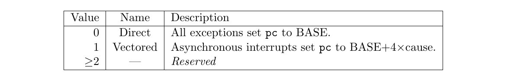
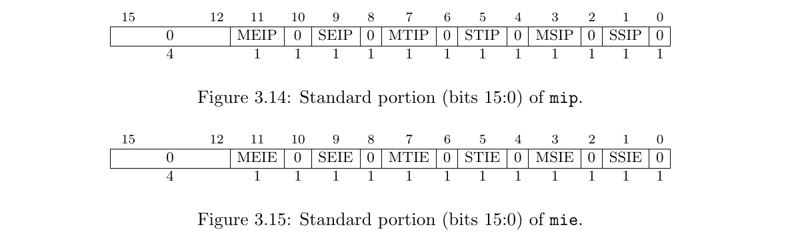
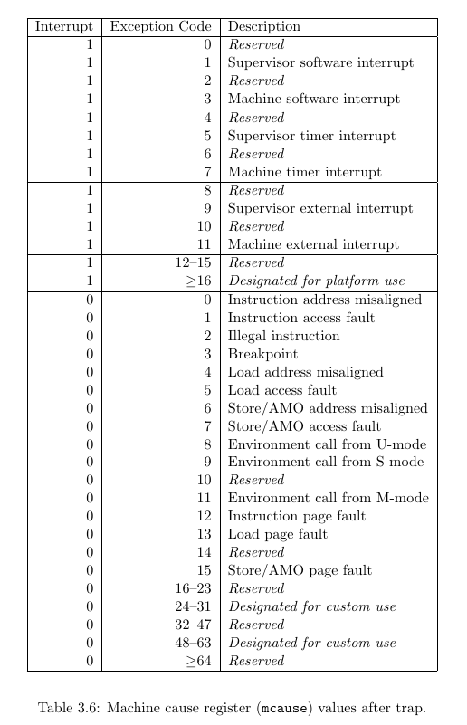
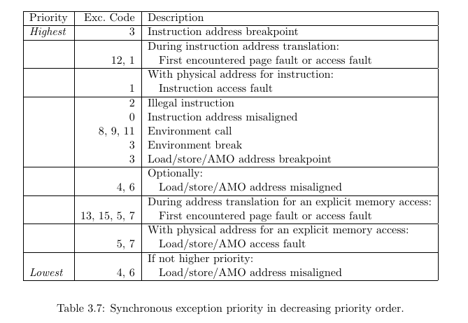
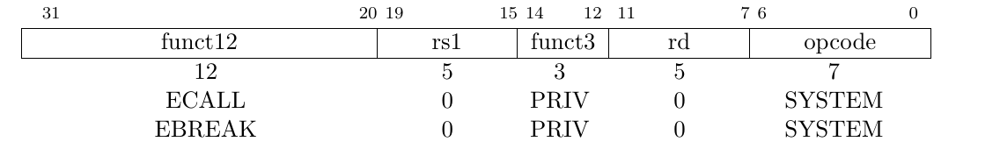
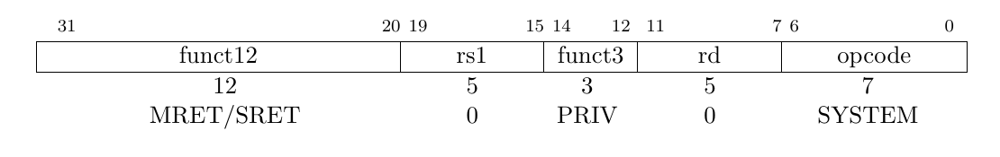

- [Général](#général)
- [L'extension Zicsr](#lextension-zicsr)
- [Les control status register](#les-control-status-register)
  - [Type de Csr](#type-de-csr)
  - [Registres machine](#registres-machine)
    - [Registre `misa`](#registre-misa)
    - [Registre `mvendorid`](#registre-mvendorid)
    - [Registre `marchid` & `mimpid`](#registre-marchid--mimpid)
    - [Registre `mstatus`](#registre-mstatus)
    - [Registre `mtvec`](#registre-mtvec)
    - [Registres `mie` et `mip`](#registres-mie-et-mip)
    - [Registre `mcycle`](#registre-mcycle)
    - [Registre `minstret`](#registre-minstret)
    - [Registre `mepc`](#registre-mepc)
    - [Registre `mcause`](#registre-mcause)
    - [Registre `mtval`](#registre-mtval)
- [Instructions mode machine](#instructions-mode-machine)
  - [`ECALL` & `EBREAK`](#ecall--ebreak)
  - [`MRET`](#mret)
  - [`WFI`](#wfi)

# Général 
On a plusieurs trucs principaux à implémenter : 
- Les instruction de l'extension Zicsr (chapitre 9 de la spec normale)
- Les constrol status registers (chapitre 2 de la spec privilégiée)
- Les niveaux de privilège
- Les interruptions / exceptions / trap 
- Quelques autres fonctionalités dans les Csr mais rien de bien compliqué
- Les intructions en mode machine
- La procédure de reset

# L'extension Zicsr 

- CSRRW : met le contenu du Csr dans rd, et le contenu de rs1 dans le Csr
- CSRRS : met le contenu du Csr dans rd, et écrit 1 dans le bits du Csr correspondant aux bits de rs1 qui valent 1 (les autres bits du Csr ne sont pas modifiés). C'est un peu comme si on faisait Csr <= Csr | rs1. 
- CSRRC : met le contenu du Csr dans rd, et écrit 0 dans le bits du Csr correspondant aux bits de rs1 qui valent 1 (les autres bits du Csr ne sont pas modifiés).

Pour les 2 derniers, si rs1 est x0, on écrit pas du tout dans le registre (donc ça marche même si le registre est read only) \
Les variantes I prennent juste un immédiat 5 bits, étendu avec des 0, à la place de rs1. 

Si le registre venait à être modifié pendant l'instruction (genre un compteur d'instruction), on lit la valeur du registre avant l'instruction, et on écrit après l'instruction. 

# Les control status register
Ils sont encodés sur 12 bits, donc il y en a 4096 de possible. On va pas du tout en implémenter autant, juste quelques uns. 

## Type de Csr

Ce qui est appelé une valeur légale cest une valeur en accord avec la documentation. Par exemple dans le cas de `misa` on doit donner le nombre de bits de notre architecture il faut donc donner une valeur dite **légale**.
- WPRI, Writes Preserve Value, Read Ignore Values : le registre fait rien, on peut pas écrire dedans et on lis toujours des 0
- WLRL, Write/ Read Only Legal Values : On part du principe que seule des valeurs "légales" sont écrites dans le registre. Si on écrit autre chose, on peut retourner n'importe quoi, ou lever une exception. 
- WARL, Write Any Values, Read Legal Values : On peut écrire n'importe quoi, un read dans le registre doit quand même toujours renvoyer une valeur légale. 

## Registres machine

### Registre `misa`
Registre de type WARL, il donne quel partie de la spec on implémente.

- MXL = longueur des instructions. Pour nous, ça vaut `01`.
- Extensions : extensions supportées, 1 bit par extension. Pour nous : `00000000100000000000100000` (les bits à un c'est : extension de base I, bit 8, et mode user qu'on doit implémenter, bit 20)
- Pour nous écrire dans `misa` ne fait rien.

### Registre `mvendorid`

Donne le numéro du vendeur, 0 pour une implémentation scolaire ou ID UPMC ?

### Registre `marchid` & `mimpid`

Pas implémenté donc on met 0 dedans

### Registre `mstatus`
Registre qui sert à contrôler tout un tas de trucs. 

- MIE : active les interruptions en mode machine  
- MPIE : valeur précédente de MIE
- MPP : mode de privilère précédent (en mode M)
- TW : En mode user, active un timeout pour l'instruction "WFI", wait for interrupt (qui gèle le processeur en attente d'une interruption).
- le reste : pas utile pour nous (doc p.21 si besoin de + de détail)

### Registre `mtvec`
Registre WARL qui contient l'adresse de base des fonctions des trap.

- base contient l'adresse de base
- mode contient le mode : soit on a un vecteur, soit tous les trap jump au même endroit. 

### Registres `mie` et `mip`
Registres qui contiennent des info sur les interruptions activées (`mie`, machine interrupt enable), et les interruptions en attente d'executions (`mip`, machine interupt pending).

En gros, une interruption numéro i (voir [mcause](#registre-mcause)) doit être lancée si : 
- Les interruptions sont activées dans `mstatus` (bit `MIE`). En mode user elles sont toujours activées. 
- Les bits numéro i de `mie` et `mip` valent 1. 

Le registre `mie` c'est un truc qu'on configure depuis le programme pour activer ou désactiver des interruptions. 

Le registre `mip` c'est un truc qui va être écrit par des d'autres source pour dire qu'une interuption doit se produire. 

16 premiers bits de ces regitres :

- MEIP / MEIS : interruptions externes
- MTIP / MTIS : interruptions de timer
- MSIP / MSIS : interruptions logicielles

Les autres bits sont pas standards

### Registre `mcycle`

Compte le nombre de cycle exécuté par le core. Registre 64 bits.

### Registre `minstret`

Comtpe le nombre d'instructions exécutée, 64 bits.

### Registre `mepc`
Registre qui stock l'adresse de l'instruction qui a causé l'interruption / le trap.

Les programmes ont le droit d'écrire dedans.

### Registre `mcause`

Registre qui contient le code d'interruption / trap. 

Le bit interrupt vaut 1 si l'exception est une interruption. 

Les codes sont les suivants : 

La priorité entre les interruptions : 

### Registre `mtval`

Lors d'un trap, contient une valeur pour aider le programme à traiter le trap. 

Par exemple, lors d'un accès mémoire faux, contient l'adresse qui a posé problème. 

Pas forcément à implémenter

# Instructions mode machine

## `ECALL` & `EBREAK`

Ecall c'est l'instruction syscall, ça généère une exception "environment-call-from-U-mode" ou "environment-call-from-M-mode".

Ebreak génère une exception de breakpoint. 

L'adresse dans `mepc` devient l'adresse de ecall ou ebreak, pas la suivante. 

## `MRET`

On set `pc` à `mepc`, on revient au mode de privilège précédent et au interrupt enable précédent. 

`mpp` est set au mode de privilège le plus bas possible après un `mret`. 

## `WFI`

"The purpose of the WFI instruction is to provide a hint to the implementation, and so a legal
implementation is to simply implement WFI as a NOP." bah ok alors

# How to implement it and what to add ?

## Exceptions :

* Instruction address misaligned  -> 
* Instruction access fault        -> no instruction at this address ?
* Illegal instruction             -> instruction doesnt exist, ``DEC``
* Breakpoint                      -> not implemented  
* Load address misaligned         -> ``EXE``
* Load access fault               ->  
* Store/AMO address misaligned    ->
* Store/AMO access fault          ->
* Environment call from U-mode    ->
* Environment call from S-mode    -> not implemented
* Environment call from M-mode    ->
* Instruction page fault          ->
* Load page fault                 ->
* Store/AMO page fault            ->

## IFETCH :

* flush pipeline case of exception

## DECOD :

* add the propagation of the curent PC
* ``signal for new pc unaligned``
* ``signal for new illegal instruction``
* ``environment call from U-mode``
* ``saving address of the last branch in case exception interrupt a branch``
* flush pipeline case of exception

## EXEC :

* add the propagation of the curent PC
* signal d'arrive d'une execption en provenance de l'ICU
* ``load address misaligned``
* ``load access fault``
* ``same with store``
* cancel the wbk in case of load detected
* cancel the load in case of exception detected
* flush pipeline case of exception

## MEM :

* add the propagation of the curent PC
* flush pipeline case of exception

## WBK :

* add the propagation of the curent PC
* flush pipeline case of exception

## KREG :

* equivalent CP0 en MIPS
* implémenter tous les registres nécessaire