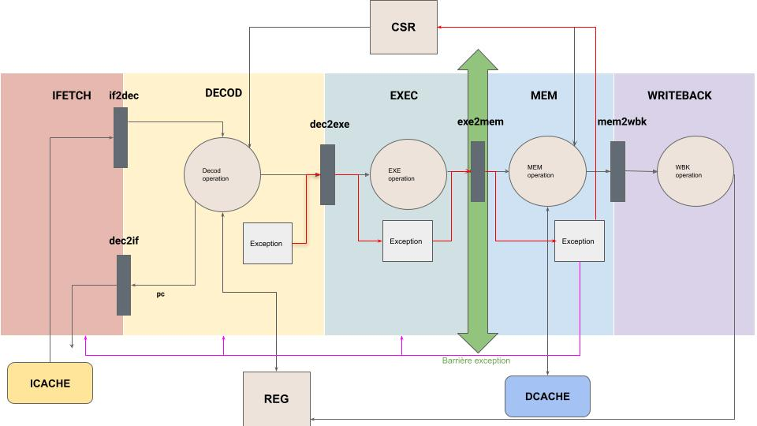

# RISC-V-project

This README file isn't complete, everything here is subject to modification. 

# Introduction :
This project as for purpose to modernise the architecture studied at Sorbonne University.\
It was realised by Timothée Le Berre, Louis Geoffroy Pitailler & Kevin Lastra during their first year of Master SESI.\
Since one decate or more, class from Master SESI used MIPS32 architecture. In this project our purpose is to create a material description of a RISCV architecture based on a 5 stage pipeline MIPS32.\
The implementation use the standard instruction set from [RISCV fondation](https://riscv.org/technical/specifications/). We choosed to implement a **RV32IM** with **Zicsr** extension and a **user** and **machine** mode.\

Here's a schema of the 5 stage pipeline of our architecture without the Kernel mode :


Here's the same schema but with the kernel Mode :



To find out more about it, please go into ``Documentation/Reports/`` and read **PSESI_final_report**.

# I. How to compile ?
## A. What's needed 

To compile the project you ll need **Systemc version 2.3.3**, g++ and a riscv compiler.\
To help you install all of this you will find two scripts in ```/Shell_script/``` :
* install_riscv.sh : it will install the riscv compiler needed, **need to be in sudo**,
* install_systemc.sh : it will install Systemc.2.3.3, **need to be in sudo**

Once everything is installed you will have to do a ```make``` in the directory ```/CORE/```. It will generate the executable core_tb.\
This file takes as argument an assembly file or a c one, once you pass it the file it will executes it using our descritption of a RISCV core.\
You will find some test programm in ``/CORE/tests``.

For example you can run ``core_tb tests/pgcd.c``.

We also write a shell script ``run_all_tests.sh`` that take all the file inside tests/ and execute it and print a message saying if the execution was a success or not.

## B. Directory map :

This project is design as follow :
* Compte_rendu : Contains a simplify spec of basic RISCV32 instructions set,
* CORE : Contains every directory needed for the architecture,
* Doc_useful : Contains some pdf that we find usefull to help us in our project,
* ELFIO : c++ library that provides a simple interface fir reading and generating files in ELF binary format,
* MIPS : old description of a MIPS32 architecture made byt the lip6 of Sorbonne Unversity, it used an old version of systemc, we modify it to be able to compile on systemc2.3.3,
* Risc-sim : contain the begining of a parsor to transfrom a assembly file into binary code
* tests : Contains some programm that are kind of test, we will move them in a permanent directory at the end of the project

```
├── CORE : Contains all the directory needed and the test bench for the whole core
│   ├── CACHES : Instruction cache and Data cache
│   ├── DEC : Decod stage
│   ├── EXE : execute stage
│   ├── IFETCH : ifetch stage 
│   ├── MEM : memory stage
│   ├── REG : bank register
│   ├── UTIL : useful stuff such as fifo
│   ├── WBK : write back stage
│   └── tests : all tests for our design (.c and .s)
|
├── Documentation : usefull documents and reports
│   ├── Reports : reports of the whole project
│   ├── Todo_kernel : a little file saying what we plan to do for the kernel
│   └──Usefull_documentation : all the doc usefull
| 
├── ELFIO : c++ elfio library
├── MIPS : an old descritpion of MIPS32 architecture in systemc
├── Shell_script : script shell for the setup of the environment
└── tests : all kind of test files
```
# II. Internal Architecture
## A. Convention :

1. **Entity** :

Signals of pure entity such as arithemitcal logic unit, shifter, fifo ...etc. It is named according to the following rules :  
 - **Upper case** : designate the input/ output of an entity
- **Lower case** : internal signals of an entity  

The name of the signal will be just a quick description of what the signal do.  We don't use the same conventions as the Stage because "pure entity" can be instantiated at different stages so it would not make sens to name it according to a stage.  
__example__ :  
- DIN : alu's data input  
- RES : alu's result  
- CMD :  alu's command  

2. **Stage :**

Our signals are name according to the following convention :  

__**Description_XY**__  

- **Description** : a quick description of what the signal means,  
- **X** : Signal type, can be a register or just a pure signal :
    * S for signal,
    * R for register
- **Y** : The initial letter of the stage it is coming from :
    * I : IFETCH,
    * D : DECOD,
    * E : EXEC,
    * M : MEM,
    * W : WBK

- **Upper case** : designate the input/ output of an entity
- **Lower case** : internal signals of an entity  

__example__ :  
    dec_to_exe_cin_stg1 : designate the signal carry in coming from decode and going to exe of the first pipeline.

## B. Kernel Architecture

Our implementation support a machine mode (11) and user mode (00). To implement this, we needed to add the Zicsr extension and we needed to choose which csr to implement.

We implemented the following Csr :
* 0: mvendorid : not implemented so 0
* 1: marchid : not implemented so 0
* 2: mimpid : not implemented so 0
* 3: mstatus : gives the current status of the CPU
* 4: misa : gives the current extension implemented in the core
* 5: mie : gives the interruption that are mask 
* 6: mtvec : gives the adress of the trap handler, our implementation supports a **direct** and **vectorise** configuration
* 7: mstatush : 
* 8: mepc : stores the adress of an instruction which occur an exception
* 9: mcause : stores the code value of an exception
* 10: mtval : stores the adress that generate an access fault or an adress missaligned excption 
* 11: mip : bit vector that indicate pending interruption 
* 12: mscratch : hold a pointer to a machine-mode hart-local context space and swapped
with a user register upon entry to an M-mode trap handler

These CSR can be found inside the csr.h file. 